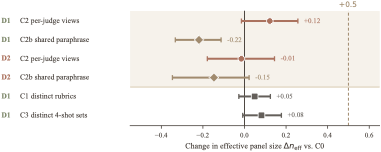

# Surface Form or Shared Belief?

This repository contains the code for the paper **Surface Form or Shared Belief? A
Behavioral Test of Whether LLM Judge Agreement Is Diversifiable**. This work
was accepted at the NewInML Workshop at NeurIPS 2026!

## Summary

LLM judges are often combined into panels and treated like independent voters.
That only helps when the judges make different mistakes. In practice, models
from different providers often agree on the same wrong answers.

This paper asks where that agreement comes from. One possibility is shared
surface form: every judge sees the same wording and reacts to the same cues. The
other possibility is shared belief: the models reach the same evaluation of the
underlying content even when the wording changes.

We find that changing the wording separately for each judge does not create
useful independence. Across both tasks, the six-model panel behaves more like
roughly two independent votes than six.

## Method

We keep a panel of six OpenAI and Anthropic models fixed and vary only the input
shown to each judge. The experiment covers two tasks:

- **ChaosNLI-MNLI:** three-way natural-language inference with 500 examples.
- **RewardBench Chat and Chat Hard:** pairwise response evaluation with 300
  examples.

The main comparison uses three conditions:

- **C0:** every judge sees the same original input.
- **C2:** every judge sees a different meaning-preserving rewrite.
- **C2b:** every judge sees the same rewrite.

The NLI experiment also tests different rubrics and different few-shot
examples. We measure error correlation, Kish effective sample size, majority
accuracy, and the persistence of errors shared by all six judges. A
noise-matched control checks whether lower correlation represents useful
information or only random disagreement.

## Results

At baseline, the six judges provide an effective panel size of 1.71 on
ChaosNLI and 2.05 on RewardBench. Giving every judge a different rewrite changes
effective panel size by only +0.12 and -0.02, respectively. Neither result
reaches the preregistered target of +0.5.

We find that a shared rewrite can make agreement stronger as opposed to weaker. On ChaosNLI,
it lowers effective panel size by 0.22 and reduces majority accuracy from 0.728
to 0.694. Shared failures are also stable: 26 of 47 unanimous ChaosNLI errors
remain unanimous after the judges receive different rewrites, and all 7
unanimous RewardBench errors persist.

<p align="center">
  
</p>

The figure shows the change in effective panel size relative to the original
input.

## Run the code

Python 3.11 or newer is required.

```bash
uv sync --extra dev --extra figures
export OPENAI_API_KEY="..."
export ANTHROPIC_API_KEY="..."
```

Prepare the two datasets:

```bash
uv run behavioural-test prepare-chaosnli
uv run behavioural-test prepare-rewardbench
```

Generate and audit the meaning-preserving views before running the
interventions:

```bash
uv run behavioural-test generate-views \
  --output data/processed/c2_views_v2.jsonl \
  --reasoning-effort low
uv run behavioural-test audit-views \
  --views data/processed/c2_views_v2.jsonl \
  --output results/c2_view_audit_v2.csv
```

Complete the generated audit before running the intervention.

Run a baseline and the per-judge view condition:

```bash
uv run behavioural-test run --condition C0
uv run behavioural-test run --condition C2 \
  --views data/processed/c2_views_v2.jsonl
uv run behavioural-test run --condition C2b \
  --views data/processed/c2_views_v2.jsonl
```

Add `--task preference` to the generation, audit, and run commands for the
RewardBench experiment. API calls are resumable, and completed judgments are
skipped.

When all runs are complete, evaluate the preregistered endpoints:

```bash
uv run behavioural-test endpoints
```

Run the local checks with:

```bash
uv run pytest
uv run ruff check .
```
